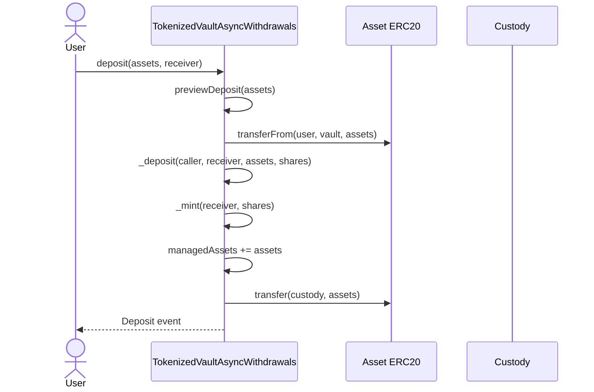
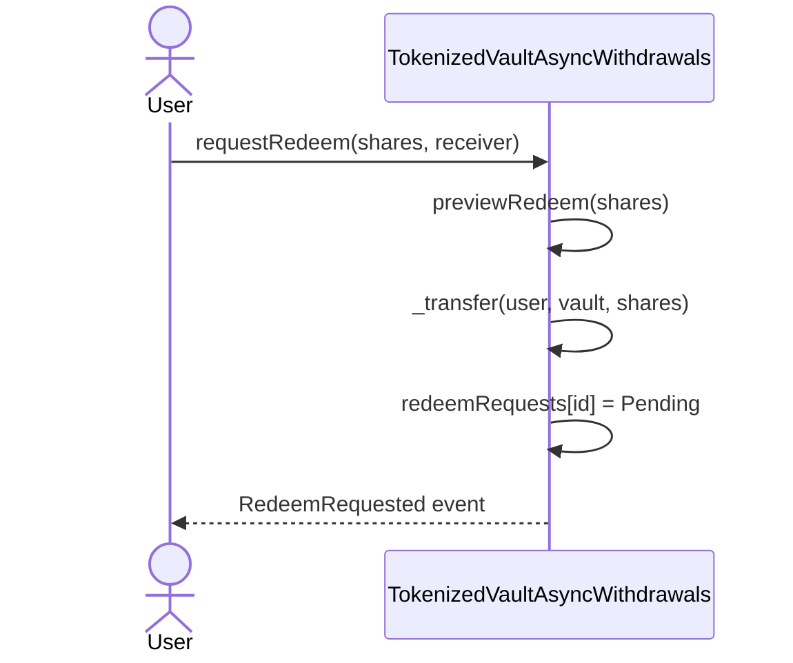
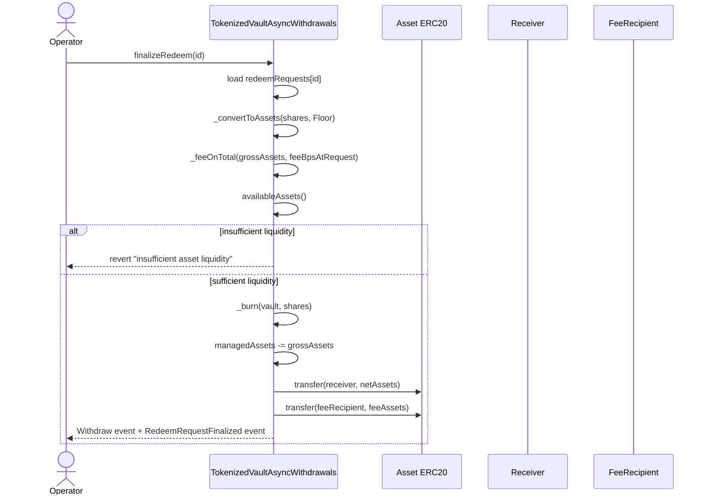
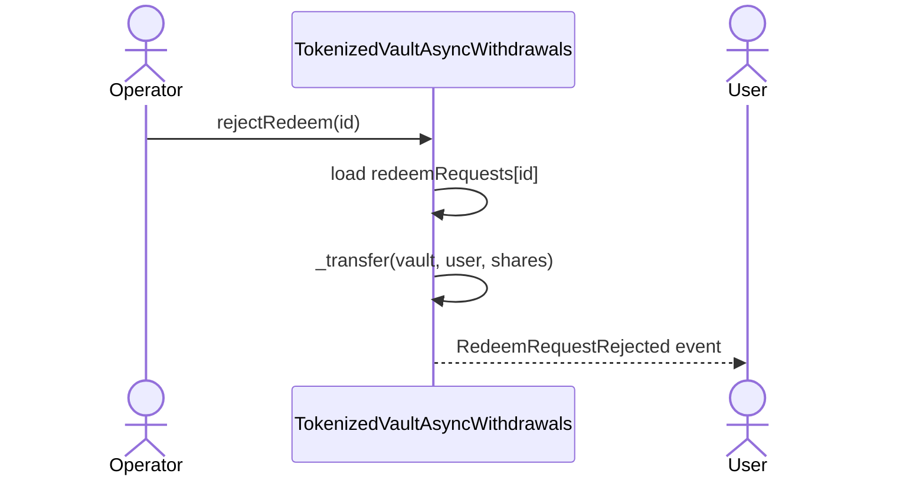

# TokenizedVaultAsyncWithdrawals

Hybrid vault:

- synchronous ERC-4626 deposits
- queued redemptions
- accountant-reported NAV through `managedAssets`
- redemption fee snapshot at request time

## Core Contract Actions

NAV / pricing:

- `reportManagedAssets(uint256 newManagedAssets)`
- `totalAssets()`
- `previewDeposit(uint256 assets)`
- `previewMint(uint256 shares)`
- `previewRedeem(uint256 shares)`

Deposits:

- `deposit(uint256 assets, address receiver)`
- `mint(uint256 shares, address receiver)`
- `_deposit(address caller, address receiver, uint256 assets, uint256 shares)`

Redemptions:

- `requestRedeem(uint256 shares, address receiver)`
- `finalizeRedeem(uint256 id)`
- `rejectRedeem(uint256 id)`

Admin / operator:

- `setFeeBps(uint256 newFeeBps)`
- `setFeeRecipient(address newFeeRecipient)`
- `setCustody(address newCustody)`

## Notes

- `totalAssets()` returns `managedAssets`, not raw token balance.
- `deposit()` and `mint()` are synchronous.
- `withdraw()` and `redeem()` are not used for exits.
- `requestRedeem()` escrows shares into the vault.
- `requestRedeem()` does not check liquidity.
- liquidity is checked only in `finalizeRedeem()`.
- the operator can finalize or reject any request by `id`.
- this is not FIFO enforcement.
- payout is **not** locked at request time.
- pending redeem value is priced at finalize time using current conversion (`convertToAssets` / `_convertToAssets`).
- redeem fee bps is locked at request (`feeBpsAtRequest`), so later fee changes do not affect older pending requests.
- `sweepTokenToCustody()` is generic and can sweep any ERC-20 held by the vault, including share token and underlying asset.
- sweeping share token or underlying asset can affect redeem finalization/liveness until balances are restored.

## UI / Operator Notes

- For each pending request, UI should treat payout as an estimate until finalized.
- To estimate current gross payout per request: `convertToAssets(shares)`.
- To estimate fee: `fee = ceil(gross * feeBpsAtRequest / (10000 + feeBpsAtRequest))`.
- Net payout estimate: `net = gross - fee`.
- Before finalizing a batch, operator should recompute totals using latest on-chain conversion and fund vault liquidity to at least total gross needed.
- Because pricing is finalize-time, pending users keep NAV exposure (upside and downside) while waiting in queue.

## Deposit Sequence

## Redeem Request Sequence

## Redeem Finalization Sequence

## Redeem Rejection Sequence

## Main Tradeoff

- deposits are standard ERC-4626
- exits are request-based
- operator discretion exists on which request `id` to process
- if strict queue ordering is required, that must be added in code

daily:
- paperclip ai
- finished subgraph
- ray integration
- 4 products, 

## thursday
- video ai suggestion for mvp
  - focus on: wihtdrawal + controlled async withdrawals
  - focus on pools on top of vaults
- custom agent neo bank
  - `Let’s also hit the protocols again after the neo banks` 
